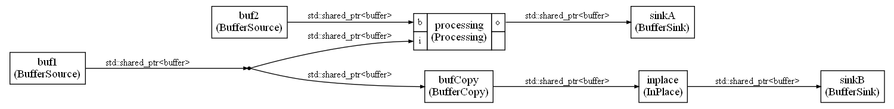
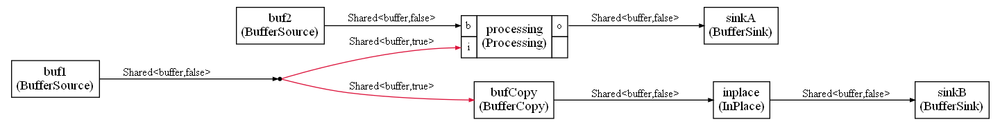

# Buffer management

When the `memoryOptimization` is enabled, the memory may be reused for different FIFOs to minimize the memory usage. But the scheduling algorithm is not trying to optimize this. So depending on how the graph was scheduled, the level of sharing may be different.

If you need to share as much as possible memory (to minimize memory usage or the amount of memory copied), you can do it if you respect a fundamental constraint : the values in the FIFOs must have value semantic and not reference semantic. 

If you share memory, you are using reference semantic and it should be hidden from the graph : one could use a copy-on-write strategy with a reference count inside the shared buffers. The reference count could also be computed statically using C++ templates if the graph has no loops. Let's look at the two way of handling the reference count. Those examples are coming from the `example12`

## Dynamic reference counting

Dynamic reference counting could make use of the C++ `shared_ptr`. The CMSIS-Stream FIFO would contain a `shared_ptr` pointing to a buffer. Most of the time, those FIFOs would have length 1 and would be optimized out by CMSIS-Stream.

The nodes would have to check for the reference count to know if they can modify the content of the buffer. If the buffer is shared, and the node needs to modify its content (algorithm using in-place modification), a copy of the buffer would be needed. Such copies could come from a memory pool of pre-allocated buffers.

At the end of a schedule iteration, the memory pool, would be reset.

In below graph, some of those ideas are illustrated:

* The `BufferSource` is generating a new buffer coming from a memory pool of pre-allocated buffers
* The `ProcessingNode` needs to generate a new buffer for the output and it gets the new buffer from a `BufferSource` on one of its inputs. The idea is to make the memory allocations visible in the graph rather than have them hidden inside the nodes
* The `inplace` node uses an algorithm that is modifying its input in-place. So, the input buffer, if it is shared, need to be duplicated. It is done by the `BufferCopy` node. `BufferCopy` will create a new copy only if the input buffer is shared.
* At the end of a schedule iteration of this graph, the memory pool is reset and the pre-allocated buffers can be reused for the next schedule iteration



There are some issues with the dynamic ref counting:

* It is difficult to know how many buffers will be needed:
  * `BufferCopy` will copy only in case of sharing
  * The level of sharing will depends on how the node executions have been scheduled
  * The other references to this node may no more be used when the `BufferCopy` node is executed
  * It makes it difficult to size the memory pool
* The nodes must check for the reference count. If they forget to do it, it may cause issues

## Static reference counting

Static reference counting is tracking the some approximation of the reference count at build time and makes it visible in the graph.

A template `Shared` has been introduced in `GenericNodes.h` It only tracks if a buffer is potentially shared or unique. 

This template is here to help communicate sharing information at the graph level. It will not prevent wrong use and it is the responsibility of the nodes to use this template in the right way.

It is no more nor no less secure than dynamic reference counting. It is a different trade-off.

With dynamic reference counting, you are sure that the reference count is correct because it is tracked by `shared_ptr`. But the nodes can be used in the wrong way and modify a buffer that has been shared. Also the sharing is difficult to track and depends on the scheduling.

With the static shared status, the shared status may be wrong if some nodes are not managing it in the right way, but once the shared status has been made available at the graph level, it is difficult to use a node in the wrong way and modify a shared buffer.

The shared status is pessimistic : once a node has used its references in the graph, the shared status will continue to be the same. The only way to reset a shared status is by copying the buffer or wait for the end of the schedule iteration. It makes the sharing more deterministic : it does not depend any more on the scheduling and only depends on the graph topology.

But it also means that some copy will occur even if for some scheduling they may not be needed.

On below graph, the type of samples is `Shared<bufferType,sharedStatus>`. 

The shared status is visible in the graph.



The status is pessimistic : in previous graph, if the `ProcessingNode` has been executed before the `BufferCopy`, the only reference to the shared buffer will be on the input to the `BufferCopy` node. So, in that case a copy is not be needed.

But statically, we cannot know it. So `BufferCopy` will always make a copy of the buffer.

The shared status enables to express some constraints in the C++ code. For instance, the `InPlace` nodes can only be used with a buffer that has not been shared. Otherwise, the solution will not build.

This result is achieved by providing a template specialization:

```c++
template<typename IN>
class InPlace<Shared<IN,false>,1,
              Shared<IN,false>,1>: 
public GenericNode<Shared<IN,false>,1,
                   Shared<IN,false>,1>
```

The shared status is explicit in the template. This node can only be used with a buffer that has not been shared.

For `ProcessingNode`, the type is more complex:

```C++
template<typename IN,bool shared>
class Processing<Shared<IN,false>,1,
                 Shared<IN,shared>,1,
                 Shared<IN,false>,1>: 
public GenericNode21<Shared<IN,false>,1,
                     Shared<IN,shared>,1,
                     Shared<IN,false>,1>
```

The type means that:

* The first input must not be shared. It is a new buffer than will be modified and passed to the output
* The output must also not be shared. It is the input buffer from the first input that is send on the output after having been modified
* The second argument can have any sharing status because it is only read by the node. So, the sharing status is not constrained by the implementation

The `Duplicate` nodes that are inserted by CMSIS-Stream automatically are also automatically changing the shared status.

But other shared status must be managed manually from the Python. For the `ProcessingNode` for instance it means than in the Python you must specify that the shared status of the second input is `true`. If status is not `true`, it won't build because it is connected to the output of the `Duplicate` node.

The template is generic, but CMSIS-Stream will generate a specific instantiation:

```C++
Processing<Shared<buffer,false>,1,Shared<buffer,true>,1,Shared<buffer,false>,1> processing(fifo0,fifo5,fifo2); /* Node ID = 5 */
```

The shared status must be coherent with the shared status used in each FIFOs.

`fifo5` is the output of the duplicate node. Its buffers all have a shared status. So, the input type for the second input must also be shared `true`.

The templates at the end will just ensure that all the choices made are coherent.

### Shared type in Python

In the Python, you can define the `Shared` datatype with:

```Python
sharedBufferType = SharedType(bufferType)
```

Where `bufferType` is the type of the buffer that are shared.

By default, this type represents an unshared buffer.

You can create a shared version with:

```Python
sharedBufferType.share()
```

And you can create an unshared version with:

```Python
theType.unique()
```

In the `example12`, the `BufferCopy1 is described with:

```Python
class BufferCopy(GenericNode):
    def __init__(self,name,theType):
        GenericNode.__init__(self,name)
        self.addInput("i",theType,1)
        self.addOutput("o",theType.unique(),1)

    @property
    def typeName(self):
        return "BufferCopy"
```

The input buffer can be shared or unshared. But the node forces the output to be an unshared buffer (since it is a copy in the C++ implementation)

### Shared type in C++

In C++ side, you can create a `Shared` object with any status :

```C++
Shared<buffer,true> sharedBuf(bufferPtr);
Shared<buffer,false> uniqueBuf(bufferPtr);
```

The object is **not** owner of the buffer. It is just tracking an estimation of the shared status.

With a shared buffer you can only get a `const` pointer:

```C++
const buffer* bufferPtr = sharedBuf.get();
```

With an unique buffer, you can also have write access to the buffer:

```C++
buffer* bufferPtr = uniqueBuf.get();
buffer* bufferPtr = uniqueBuf;
```

When you have an unshared pointer, you can change the status with:

```C++
sharedReference = uniqueReference.share();
```

The `share` function set the shared status to `true`.

