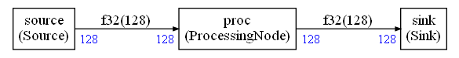

# FAQs

## Table of contents

* [Alignment](#alignment)
* [Latencies](#latencies)
* [Performances](#performances)
* [Sources and Sinks](#sources-and-sinks)

## Alignment

When the `memoryOptimization` mode is enabled, the memory can be shared between different FIFOs (when the FIFOs are in fact used as simple arrays).

In this case, the type of the memory buffers is `uint8_t`. And this memory can be used with FIFOs of different types (`float32_t`, `q31_t`).

So, it is important to align the buffers because the compiler may generate instructions which are requiring an aligned buffer thinking that the type of the buffer is different from `uint8_t`.

This can be achieved by defining `CG_BEFORE_BUFFER` in the global custom header included by the scheduler.

For instance:

`#define CG_BEFORE_BUFFER __ALIGNED(4)`

This is not needed when `memoryOptimization` is `False` in the Python configuration.

The read buffer and write buffers used to interact with a FIFO have the alignment of the FIFO datatype but no more (assuming the underlying memory is aligned in case its type is `uint8_t`)

If the number of samples read is `NR` and the number of samples written if `NW`, the alignments (in number of samples) may be:

* `r0 . NR` for a read buffer in the FIFO (where `r0 ` if an integer with `r0 >= 0`)
* `w . NW - r1 . NR` for a write buffer in the FIFO (where `r1 ` and `w` are integers with `r1 >= 0` and `w >= 0`)

If you need a stronger alignment, you'll need to chose `NR` and `NW` in the right way.

For instance, if you need an alignment on a multiple of `16` bytes with a buffer containing `q31_t`, then `NW` and `NR` need to be multiple of `4`.

If you can't choose freely the values of `NR` and `NW` then you may need to do a copy inside your component to align the buffer (of course only if the overhead due to the lack of alignment is bigger than doing a copy.)

## Latencies

The compute graph schedule is computed only based on the dataflow dependencies and with an attempt at minimizing the FIFO sizes.

No other constraint is used. But in a real application, it is not enough. For instance, this kind of scheduling would be acceptable from a pure data flow point of view (ignoring FIFO sizes for this example):

* source, source, sink, sink

But from a latency point of view it would not be good and the following schedule should be prefered:

* source, sink, source, sink 

The scheduling algorithm is thus using a topological sort of the compute graph to try to schedule the sinks as soon as possible in order to minimize the source to sink latency. This optimization is disabled when the graph has some loops because in this case there is no possible topological sort.

But, even with topological sorting, there may be cases where the latency is unavoidable without changing the amount of samples read and written by the nodes. In a dynamic scheduler it is something which is more difficult to track. With a static scheduler you can see it in the generated schedule.

As an example, if you use 10 ms audio blocks at 16 kHz you get 160 samples.

Now, if you want to want to compute a FFT of 256 samples (smallest power of 2 > 160), then you'll need to receive 2 audio blocks before you can start to compute the FFT and generate output samples.

So, in the generated schedule you'll see sequences like :

* source, source ... sink 

which is showing there will be a latency issue. The connection between the sink and an audio DMA will require more buffers than with a schedule like source ... sink ... source ... sink.

To solve this problem you need either to:

* Use different length for the audio blocks
* Use a FFT which is not a power of 2 


## Performances

The use of C++ templates is giving more visibility to the compiler:

* The number of samples read and written on the FIFOs are statically known ;
* When a FIFO is used as a simple array : it is statically visible to the compiler 
* The dataflow between the nodes is statically visible

It enables the compiler to generate better code for the C++ wrappers and minimize the overhead.

As an example, let's look at the graph:



The full code for all the nodes is:

```C++
template<typename IN, int inputSize>
class Sink;

template<int inputSize>
class Sink<float32_t,inputSize>: 
public GenericSink<float32_t, inputSize>
{
public:
    Sink(FIFOBase<float32_t> &src):
    GenericSink<float32_t,inputSize>(src){
    };

    int run()
    {
        float32_t *b=this->getReadBuffer();
        for(int i=0;i<inputSize;i++)
        {
            output[i] = b[i];
        }
        return(0);
    };

    

};

template<typename OUT,int outputSize>
class Source;

template<int outputSize>
class Source<float32_t,outputSize>: GenericSource<float32_t,outputSize>
{
public:
    Source(FIFOBase<float32_t> &dst):
    GenericSource<float32_t,outputSize>(dst){};

    int run(){
        float32_t *b=this->getWriteBuffer();
        for(int i=0;i<outputSize;i++)
        {
            b[i] = input[i];
        }
        return(0);
    };


};

template<typename IN, int inputSize,typename OUT,int outputSize>
class ProcessingNode;

template<int inputSize>
class ProcessingNode<float32_t,inputSize,float32_t,inputSize>: 
public GenericNode<float32_t,inputSize,float32_t,inputSize>
{
public:
    ProcessingNode(FIFOBase<float32_t> &src,FIFOBase<float32_t> &dst):
    GenericNode<float32_t,inputSize,float32_t,inputSize>(src,dst){};

    int run(){
        float32_t *a=this->getReadBuffer();
        float32_t *b=this->getWriteBuffer();
        arm_offset_f32(a,0.5,b,inputSize);
       
        return(0);
    };

};
```

The `input` and `output` arrays, used in the sink / source, are defined as extern. The source is reading from `input` and the sink is writing to `output`.

The generated scheduler is:

```C++
uint32_t scheduler(int *error)
{
    int cgStaticError=0;
    uint32_t nbSchedule=0;
    int32_t debugCounter=1;

    CG_BEFORE_FIFO_INIT;
    /*
    Create FIFOs objects
    */
    FIFO<float32_t,FIFOSIZE0,1,0> fifo0(buf0);
    FIFO<float32_t,FIFOSIZE1,1,0> fifo1(buf1);

    CG_BEFORE_NODE_INIT;
    /* 
    Create node objects
    */
    ProcessingNode<float32_t,128,float32_t,128> proc(fifo0,fifo1);
    Sink<float32_t,128> sink(fifo1);
    Source<float32_t,128> source(fifo0);

    /* Run several schedule iterations */
    CG_BEFORE_SCHEDULE;
    while((cgStaticError==0) && (debugCounter > 0))
    {
        /* Run a schedule iteration */
        CG_BEFORE_ITERATION;
        for(unsigned long id=0 ; id < 3; id++)
        {
            CG_BEFORE_NODE_EXECUTION;

            switch(schedule[id])
            {
                case 0:
                {
                   cgStaticError = proc.run();
                }
                break;

                case 1:
                {
                   cgStaticError = sink.run();
                }
                break;

                case 2:
                {
                   cgStaticError = source.run();
                }
                break;

                default:
                break;
            }
            CG_AFTER_NODE_EXECUTION;
            CHECKERROR;
        }
       debugCounter--;
       CG_AFTER_ITERATION;
       nbSchedule++;
    }

errorHandling:
    CG_AFTER_SCHEDULE;
    *error=cgStaticError;
    return(nbSchedule);
}
```

If we look at the asm of the scheduler generated for a Cortex-M7 with `-Ofast` with armclang `AC6.19` and for **one** iteration of the schedule, we get (disassembly is from uVision IDE):

```txt
0x000004B0 B570      PUSH          {r4-r6,lr}
    97:             b[i] = input[i]; 
0x000004B2 F2402518  MOVW          r5,#0x218
0x000004B6 F2406118  MOVW          r1,#0x618
0x000004BA F2C20500  MOVT          r5,#0x2000
0x000004BE 4604      MOV           r4,r0
0x000004C0 F2C20100  MOVT          r1,#0x2000
0x000004C4 F44F7200  MOV           r2,#0x200
0x000004C8 4628      MOV           r0,r5
0x000004CA F00BF8E6  BL.W          0x0000B69A __aeabi_memcpy4
0x000004CE EEB60A00  VMOV.F32      s0,#0.5
   131:         arm_offset_f32(a,0.5,b,inputSize); 
0x000004D2 F2404618  MOVW          r6,#0x418
0x000004D6 F2C20600  MOVT          r6,#0x2000
0x000004DA 2280      MOVS          r2,#0x80
0x000004DC 4628      MOV           r0,r5
0x000004DE 4631      MOV           r1,r6
0x000004E0 F002FC5E  BL.W          0x00002DA0 arm_offset_f32
    63:             output[i] = b[i]; 
0x000004E4 F648705C  MOVW          r0,#0x8F5C
0x000004E8 F44F7200  MOV           r2,#0x200
0x000004EC F2C20000  MOVT          r0,#0x2000
0x000004F0 4631      MOV           r1,r6
0x000004F2 F00BF8D2  BL.W          0x0000B69A __aeabi_memcpy4
   163:        CG_AFTER_ITERATION; 
   164:        nbSchedule++; 
   165:     } 
   166:  
   167: errorHandling: 
   168:     CG_AFTER_SCHEDULE; 
   169:     *error=cgStaticError; 
   170:     return(nbSchedule); 
0x000004F6 F2402014  MOVW          r0,#0x214
0x000004FA F2C20000  MOVT          r0,#0x2000
0x000004FE 6801      LDR           r1,[r0,#0x00]
0x00000500 3101      ADDS          r1,r1,#0x01
0x00000502 6001      STR           r1,[r0,#0x00]
   171: } 
0x00000504 2001      MOVS          r0,#0x01
0x00000506 2100      MOVS          r1,#0x00
   169:     *error=cgStaticError; 
0x00000508 6021      STR           r1,[r4,#0x00]
0x0000050A BD70      POP           {r4-r6,pc}
```

It is the code you would get if you was manually writing a call to the corresponding CMSIS-DSP functions. All the C++ templates have disappeared. The switch / case used to implement the scheduler has also been removed.

The code was generated with `memoryOptimization` enabled and the Python script detected in this case that the FIFOs are used as arrays. As consequence, there is no FIFO update code. They are used as normal arrays.

The generated code is as efficient as something manually coded.

The sink and the sources have been replaced by a `memcpy`. The call to the CMSIS-DSP function is just loading the registers and branching to the CMSIS-DSP function.

It is not always as ideal as in this example. But it demonstrates that the use of C++ templates and a Python code generator is enabling a low overhead solution to the problem of streaming and compute graph.

## Sources and Sinks

The sinks and the sources are where the graph is connected to the system.

In the implementation of the sinks and sources you may have to rely on an RTOS to synchronize with another thread or write code to interact with an interrupt. The CMSIS-Stream scheduler would probably run in its own thread. The sources and sinks may block the execution of the scheduler until enough data is available for the source or enough free memory is available for the sink to generate its data.

A simple way to create sources and sinks is to use RTOS queues. 

A schedule is generally interleaving the source and sink execution : **source** ... some other nodes ... **sink** ... some other nodes ... **source** ...

But for some graphs, it may not be possible and you may see successive executions of sources or sinks : **source** ... some other nodes ... **source** ... some other nodes ... **sink** ... some other nodes ... **sink** ...

The [simple example](Examples/simple/README.md) is an example of a graph where the scheduling is requiring successive executions of sources and sinks.

In that case, connection between the graph and the system will require more buffering and the graph will introduce more latency. You should try to modify the amount of samples produced and consumed by the nodes so that source and sink execution can be interleaved and the latency introduced by graph scheduling minimized.

For debugging it is sometimes useful to have a sink doing nothing. It is possible for a sink to do nothing with its data. But it still has to manage the FIFO by calling the `getReadBuffer` functions. The scheduling algorithm (in synchronous mode) is assuming that the same amount of data is read or written to a FIFO by a node at each execution. So FIFO pointers must be updated even if you don't want to read the content of thee FIFO or write to the content of the FIFO.
