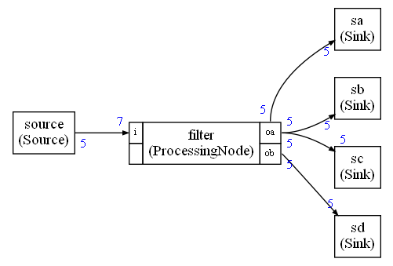
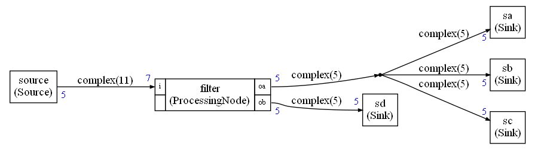

# Graphviz generation

## Graph generation after scheduling

```python
def graphviz(self,f,config=Configuration())
```

It is a method of the **schedule** object returned by `computeSchedule`.

* `f` : Opened file where to write the graphviz description
* `config` : An optional configuration object

## Graph generation before scheduling

Generating the graph before the scheduling computation can be useful to find problems. Sometimes the scheduling is failing because the graph has some issues : IOs not connected, loops without the right delays ...

To generate the graph before the scheduling, you can use the `graphviz` function on the **graph** object and before using the `computeSchedule` function that is rewriting the graph

```python
def graphviz(self,f,config=Configuration())
```

This is a method of the **graph** object.

## Pre and post scheduling graph

There are differences between the pre-schedule graph and the post-schedule graph:

* In pre-schedule, you don't know the size of the FIFOs (in fact there is no FIFO)
* The `Duplicate` nodes (and additional FIFOs) have not been inserted to implement one-to-many outputs

### Pre-scheduling graph example

In this graph, all sinks are connected to the `oa` output of the `filter` node. That is not correct for the scheduling point of view since each output of the C++ implementation is connected to only one FIFO.

The scheduling phase will introduce a `Duplicate` node

The edges have no information of datatype or capacity (number of samples).



### Post-scheduling graph example

In this graph, datatype (`complex`) and capacity (`11` or `5` samples) have been added to the edges.

A `Duplicate` node has been inserted at the output `oa` of the `filter` node.



## Options for the graphviz generator

### horizontal (default = True)

Horizontal or vertical layout for the graph.

### displayFIFOBuf (default = False)

By default, the graph is displaying the FIFO sizes computed as result of the scheduling. If you want to know the FIFO variable names used in the code, you can set this option to true and the graph will display the FIFO variable names.