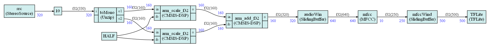
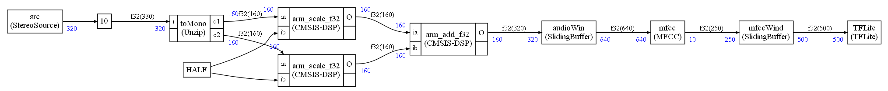

# Graph picture styling

When the graph is complex, it can be interesting to customize the look of the graphical representation, highlight some nodes, some edges ...

It is possible to change lots of aspects of the style.

There are global style settings that are applied to all elements of the graph, and local style settings that are applied only to specific nodes, edges, ports.

A global style setting is defined in a dictionary. A local style setting is a method of a class that must be overridden.

To generate a graph with some style you use the option `style` of the `graphviz` function:

```python
schedule.graphviz(file,config=your_config,style=your_style)
```

Two default styles are available:

* `Style.default_style()`
* `Style.dark_style()`

## Global setting change

If you want to change some settings, you define a dictionary with new values for those settings and you create a `Style` object using this dictionary:

`myStyle=Style(myDictionary)`

You don't need to define a value for all the settings recognized in a dictionary. You only need to provide values for the global settings you want to change. For instance:

```python
newBackground = {"graph_background"      : "gray"}
```

Any setting not defined in the dictionary will use a value from the default style. And if you don't pass any dictionary, the default global settings will be used.

The list of all global settings is:

```python
_DEFAULT_STYLE = {
    # Graph global settings
     "graph_background"      : "white"       # Color of graph background
    ,"graph_font"            : "Times-Roman" # Font used in the graph

    # Node settings
    ,"node_color"            : "none"        # Fill color of any node
    ,"node_boundary_color"   : "black"       # Boundary color of any node
    ,"node_label_size"       : "14.0"        # Font size of node labels
    ,"node_label_color"      : "black"       # Color of node labels

    # Special node settings (Constant node and delay box)
    ,"special_node_border"   : "1"           # Thickness of node boundary

    # Node port settings (port = input or output of a node)
    ,"port_sample_color"     : "blue"        # Color of number of samples
    ,"port_sample_font_size" : "12.0"        # Font size of number of samples

    ,"port_font_color"       : "black"       # Color of a port
    ,"port_font_size"        : "12.0"        # Font size of a port

    # Edge settings
    ,"edge_color"            : "black"       # Color of any edge
    ,"edge_label_size"       : "12.0"        # Font size of any edge label
    ,"edge_label_color"      : "black"       # Color of any edge label
    ,"edge_style"            : "solid"       # Edge style (dashed, dotted ...)
    ,"arrow_size"            : 0.5           # Arrow size at end of edge
    }
```

## Local setting change

To change the setting for a particular element of the graph (like a specific node), you need to inherit from the`Style` class and override a specific method.

For instance, to change the filling color of a specific node, you could define:

```python
class MyStyle(Style):
    def node_color(self,node):
        if node.isPureNode:
           return("burlywood1")
        return super().node_color(node)
```

This node function will change the filling color of all nodes that are pure functions (like CMSIS-DSP functions with no state). Otherwise, the default styling will be used.

This object can be created with a dictionary of global settings:

```python
MyStyle(globalStyle)
```

but if no dictionary is used, the default settings are used by `MyStyle`

## Global settings

### Graph background color

Controlled with the `graph_backround` dictionary item:


### Font

Controlled with the `graph_font` dictionary item:


### Boundary node color

Controlled with the `node_boundary_color` dictionary item:


### Node filling color

Controlled with the `node_color` dictionary item:



### Node label color

Controlled with the `node_label_color` dictionary item:


### Node label size

Controlled with the `node_label_size` dictionary item:


### Port color

Controlled with the `port_font_color` dictionary item:


### Port font size

Controlled with the `port_font_size` dictionary item:


### Port sample color

Controlled with the `port_sample_color` dictionary item:


### Port sample font size

Controlled with the `port_sample_font_size` dictionary item:


### Special nodes border thickness

Controlled with the `special_node_border` dictionary item:


### Edge color

Controlled with the `edge_color` dictionary item:


### Edge label color

Controlled with the `edge_label_color` dictionary item:


### Edge label size

Controlled with the `edge_label_size` dictionary item:


### Edge style

Controlled with the `edge_style` dictionary item:


## Local settings

Settings applied to a specific node, edge or port.

### Local Edge color

```python
def edge_color(self,edge):
```


### Local edge label

```python
def edge_label(self,edge):
```


### Local edge label color

```python
def edge_labe_color(self,edge):
```


### Local edge label size

```python
def edge_label_size(self,edge):
```


### Local edge style

```python
def edge_style(self,edge):
```


### Local node boundary color

```python
def node_boundary_color(self,node):
```


### Local node color

```python
def node_color(self,node):
```


### Local node label

```python
def node_label(self,node):
```


### Local node label color

```python
def node_label_color(self,node):
```


### Local node label size

```python
def node_label_size(self,node):
```


### Local port color

```python
def port_font_color(self,item,i,input=False):
```


### Local port font size

```python
def port_font_size(self,item,i,input=False):
```



### Local port sample color

```python
def port_sample_color(self,nb_sample):
```


### Local port sample font size

```python
def port_sample_font_size(self,nb_sample):
```


### Const node border

```python
def const_border(self,const_name):
```


### Const node boundary color

```python
def const_boundary_color(self,const_name):
```


### Const node filling color

```python
def const_color(self,const_name):
```


### Const node edge color

```python
def const_edge_color(self,name,dstPort):
```


### Const node edge style

```python
def const_edge_style(self,name,dstPort):
```


### Const node label color

```python
def const_label_color(self,const_name):
```


### Const node label size

```python
def const_label_size(self,const_name):
```


### Delay box border thickness

```python
def delay_border(self,delay_value):
```


### Delay box border color

```python
def delay_boundary_color(self,delay_value):
```


### Delay box filling color

```python
def delay_color(self,delay_value):
```


### Delay box edge color

```python
def delay_edge_color(self,srcPort,nb_samples):
```


### Delay box edge style

```python
def delay_edge_style(self,srcPort,nb_samples):
```


### Delay box label color

```python
def delay_label_color(self,delay_value):
```


### Delay box label size

```python
def delay_label_size(self,delay_value):
```


## 