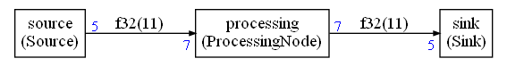

## How to write the Python script

This is a continuation of the [Simple graph creation example](Examples/simple/README.md).

The files are in the `Examples/simple` folder.

This document details how to write a Python script to describe a graph. It assumes some minimal knowledge about Python class and inheritance.

Let's look at the required steps in reverse order starting first with how to compute the schedule and generate the C++ code for the scheduler.

### Schedule computation and C++ generation

The Python script `create.py` will generate the C++ scheduler when run. This file is assuming that the nodes and the graph have already been defined somewhere else. The first lines of this script are including the nodes and graph definitions:

```python
from nodes import * 
from graph import * 
```

For this example, we don't want the schedule to run forever which should be the case for a stream computation. The first thing the script is doing is limiting the number of schedule iterations to 1 by setting a field in the configuration object:

```python
conf = Configuration()
conf.debugLimit = 1
```

This corresponds to one iteration of the schedule but the schedule may contain several executions of the different nodes in one iteration.

Then, with all those configurations and a graph description, we are ready to compute the static schedule:

```python
scheduling = the_graph.computeSchedule(config = conf)
```

`the_graph` variable has been imported from `graph.py`. `the_graph` is the description of the compute graph.

Once the schedule has been computed, we can print some statistics:

```python
print("Schedule length = %d" % scheduling.scheduleLength)
print("Memory usage %d bytes" % scheduling.memory)
```

The scheduling length is the number of node executions required for one scheduling iteration.

The memory usage is the space required by all the FIFOs expressed in bytes.

With this example, the output should be:

```
Schedule length = 19
Memory usage 88 bytes
```

We can see that the schedule length is a bit long for 3 nodes : 19. And it is because the sink / source are processing packets of 5 samples and the processing node is processing packets of 7 samples. So, a scheduling iteration will require several executions of the different nodes in order to implement a periodic scheduling that can be iterated to process the whole stream.

We can see in the picture of the graph that the connections between the nodes are requiring 11 samples.

That's why we have 88 bytes of memory used. Each sample is 4 byte long (a float):



The nodes in this graph are always producing or consuming the same amount of data on an IO each time they are executed:

* 5 samples produced by the `source`
* 5 samples consumed by the `sink`
* 7 samples on the `processing` node input
* 7 samples on the `processing` node output

We say that the graph is **synchronous or static**. It is only in this case that it is possible to compute a schedule at build time. This case is general enough to cover most of the use-cases. But when it is really not possible to use the synchronous mode, CMSIS-Stream is supporting two extensions:

- [Cyclo-static scheduling](Documentation/CycloStatic.md)

- [Dynamic / Asynchronous mode](Documentation/Async.md)

Now that we have computed the scheduling, we are ready to generate the C++ implementation:

```python
scheduling.ccode("generated",conf)
```

`"generated" ` is the name of the folder where the files are generated (relative to the working directory of the script). It is possible to customize the naming of the generated files using the `Configuration` object `conf` .

We can also generated a `graphviz` file that can then be processed with the `dot` tool to generate a picture of the graph:

```python
with open("simple.dot","w") as f:
    scheduling.graphviz(f)
```

Those lines are creating a `"simple.dot"` file from the graph **and** the computed schedule. The computed schedule is used to display the length of the connections between the nodes.

### Describing the graph

Now that we know how to compute a schedule and generate a C++ implementation, let's see how to describe the graph.

The file `graph.py` contains the Python code used to describe the graph. The first lines of the script are loading the node definitions and some standard definitions from the CMSIS-Stream Python package:

```python
from cmsis_stream.cg.scheduler import *
from nodes import * 
```

We need the definitions from the CMSIS-Stream Python wrapper to define the datatypes used by the nodes. By default only basic datatypes are provided : `float32`, `int16_t` ... It is also possible to define a C struct datatype.

The example is using `float`:

```python
floatType = CType(F32)
```

#### How to instantiate the nodes

The nodes are created like any other Python object. The API is not standardized. The compute graph should be able to work with any library of standard components. In this example, the node APIs are first listing the inputs, then the outputs. And for each IO, we define the data type and the number of samples produced or consumed.

##### How to instantiate the source:

```python
src = Source("source",floatType,5)
```

A Python object `src` is created from the Python class `Source`. In the generated code, and in the pictures of the graph, this node will be named `source`. This name must thus be a valid C variable name.

The datatype is the second argument of the constructor. It is the float datatype we defined just before. The last argument is the number of sample produced by the node at each execution : 5 samples.

##### How to instantiate the processing node:

```python
processing = ProcessingNode("processing",floatType,7,7)
```

It is very similar to the source. We just need to specify two sizes : the number of samples consumed and number of samples produced. This node is using the same data type for both input and output.

As we will see later, the C++ implementation of the node is only supporting the case where the number of samples produced is equal to the number of samples consumed. If it is not the case, the solution won't build. The problem is caught at the C++ type system level. This constraint could have been enforced at the Python level.

It demonstrates that a Python description of a node can be very generic and anticipate on future use cases without introducing problem at runtime since some validation is occurring on the C++ side.

##### How to instantiate the sink:

```python
sink = Sink("sink",floatType,5)
```

It is very similar to the source.

#### How to connect the nodes:

Now that we have defined the nodes, they need to be connected to create a graph. First a `Graph` object must be created:

```python
the_graph = Graph()
```

This `Graph` class is defined in `cmsis_stream.cg.scheduler`

Now we can connect the nodes:

```python
the_graph.connect(src.o,processing.i)
the_graph.connect(processing.o,sink.i)
```

The properties `i` and `o` of the nodes have been created during description of the nodes. It is not imposed by the framework. The input / output can be named as you want if they do not conflict with existing properties of the Python objects.

### Describing the nodes

Let's now detail how to create the nodes. Those descriptions can be seen as a datatype for a node. They define:

* The number of IOs
* The datatype used for each IO
* The number of samples produced or consumed on each IO

The script `nodes.py` is defining the nodes needed for this example. The first line is importing some definitions from the CMSIS-Stream Python wrapper:

```python
from cmsis_stream.cg.scheduler import GenericNode,GenericSink,GenericSource
```

#### The source

The source is defined with:

```python
class Source(GenericSource):
    def __init__(self,name,theType,outLength):
        GenericSource.__init__(self,name)
        self.addOutput("o",theType,outLength)

    @property
    def typeName(self):
        return "Source"
```

It is a lot but it is not complex. Let's detail each part of this definition:

```python
class Source(GenericSource):
```

The `Source` class is inheriting from the `GenericSource` class. CMSIS-Stream Python Wrapper is defining `GenericSource`, `GenericSink` and `GenericNode`.

Then, we define the constructor of this class:

```python
def __init__(self,name,theType,outLength):
        GenericSource.__init__(self,name)
        self.addOutput("o",theType,outLength)
```

The constructor is first initializing the super class `GenericSource`. Then, it is defining the input or output. In a `GenericSource` we only have access to the `addOutput` function.

This function is taking three arguments:

* First argument : the name `"o"` of the output. It will become a property of the object and then can be used like any other Python property 
* The type `theType` of the output. In our example it is the `floatType` passed in argument of the constructor
* The number of samples `outLength` produced on this output in synchronous mode

As we can see : the API is defined by the constructor `__init__` So the API is not enforced by the compute graph. The developer of the nodes can choose whatever API is the best for a given use case

There is a last part in the definition of the node:

```python
@property
    def typeName(self):
        return "Source"
```

This defines the name of the C++ wrapper implementing the node.

#### The processing node

The processing node is defined in the same way but with input and outputs:

```python
class ProcessingNode(GenericNode):
    def __init__(self,name,theType,inLength,outLength):
        GenericNode.__init__(self,name)
        self.addInput("i",theType,inLength)
        self.addOutput("o",theType,outLength)

    @property
    def typeName(self):
        return "ProcessingNode"
```


#### The sink

The sink is defined in a similar way with just an input.

```python
class Sink(GenericSink):
    def __init__(self,name,theType,inLength):
        GenericSink.__init__(self,name)
        self.addInput("i",theType,inLength)

    @property
    def typeName(self):
        return "Sink"
```

