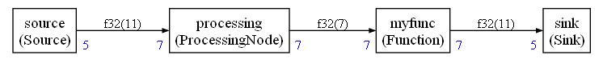

# README





## Principle of operation

The sink is synchronized with the main function using the global variable `g_frame_available`.

When no frame is available, the sink pauses the execution.

The main loop sets `g_frame_available` to 1 to resume the execution. The execution of the sink is restarted. The sink can detect if it is being resumed or if it is a new execution by calling the function `executionStatus`

Pure functions (like `myfunc` in this example) cannot suspend the execution


### Expected output

```
Start
Source
Source
ProcessingNode
-- Pause
Resume sink
Sink
2
3
4
5
6
Source
ProcessingNode
-- Pause
Resume sink
Sink
2
3
4
5
6
Source
Source
ProcessingNode
-- Pause
Resume sink
Sink
2
3
4
5
6
-- Pause
Resume sink
Sink
2
3
4
5
6
Source
ProcessingNode
-- Pause
Resume sink
Sink
2
3
4
5
6
Source
ProcessingNode
-- Pause
Resume sink
Sink
2
3
4
5
6
-- Pause
Resume sink
Sink
2
3
4
5
6
Source
Source
ProcessingNode
-- Pause and end
Nb sched = 1
```


