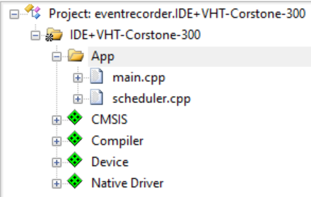

# README

This example is inside the folder `examples/eventrecorder` of the CMSIS-Stream folder.

This example explains how to enable the [Event Recorder](https://www.keil.com/pack/doc/compiler/EventRecorder/html/index.html) for the scheduling of the following graph:


You need to understand the [simple example](../simple/README.md) before reading this documentation

This example is using [CMSIS build tools](https://github.com/Open-CMSIS-Pack/devtools/tree/main/tools) and the command line tool [eventlist](https://github.com/ARM-software/CMSIS-View/tree/main/tools/eventlist) to format the events from the  [Event Recorder](https://www.keil.com/pack/doc/compiler/EventRecorder/html/index.html) .

You need to understand how to use the  [CMSIS build tools](https://github.com/Open-CMSIS-Pack/devtools/tree/main/tools) before reading this documentation if you want to run the example from command line.

You can also use an IDE supporting the CMSIS-Pack and Event Recorder technology : uVision is used for this example.

## Event recording in the compute graph

You can enable Event recorder for the code generation by setting the following property to `true` before generating the C++ code.

```Python
conf.eventRecorder = True
```

The C++ code will contain calls to `EventRecord2`.

The event recorder header must be included from the scheduler. In can be done, for instance, in the `custom.h` file that is included by default by the scheduler:

```c
#if defined(RTE_Compiler_EventRecorder)
#include "EventRecorder.h"
#endif 
```

The `EventRecord2` calls are using some constant to identify the events to generate. Those constants are generated in the header `scheduler.h`

```C++
#define CG_EvtSched 0x01 

#define CG_Evt_Scheduler   EventID (EventLevelAPI,   EvtSched, 0x00)
#define CG_Evt_Node        EventID (EventLevelAPI,   EvtSched, 0x01)
#define CG_Evt_Error       EventID (EventLevelError,   EvtSched, 0x02)
```

Three events are defined:

* An event for the start of the scheduling iteration
* An event for execution of a node
* An event in case of error

In this example, the computed scheduling is described by the array:

```C++
static unsigned int schedule[19]=
{ 
2,2,0,1,2,0,1,2,2,0,1,1,2,0,1,2,0,1,1,
};
```

We should be able to see this schedule thanks to the recorder events.

## Command line execution

You need to build the example with the cmsis build tools (assuming all the needed packs are already installed):

`csolution convert -s example.csolution_ac6.yml`

`cbuild "eventrecorder.CommandLine+VHT-Corstone-300.cprj"`

Now, you can run the example on AVH using the command:

`run.bat`

if you're not on Windows, you can just change the paths in this script.

The execution on AVH should display:

```
telnetterminal0: Listening for serial connection on port 5000
telnetterminal2: Listening for serial connection on port 5001
telnetterminal5: Listening for serial connection on port 5002
telnetterminal1: Listening for serial connection on port 5003

    Ethos-U rev 136b7d75 --- Feb 16 2022 15:53:42
    (C) COPYRIGHT 2019-2022 Arm Limited
    ALL RIGHTS RESERVED

Start
Source
Source
ProcessingNode
Sink
1
2
3
4
5
Source
ProcessingNode
Sink
1
2
3
4
5
Source
Source
ProcessingNode
Sink
1
2
3
4
5
Sink
1
2
3
4
5
Source
ProcessingNode
Sink
1
2
3
4
5
Source
ProcessingNode
Sink
1
2
3
4
5
Sink
1
2
3
4
5
Number of schedule iterations = 1
Error code = 0

Info: /OSCI/SystemC: Simulation stopped by user.
[warning ][main@0][01 ns] Simulation stopped by user
```

A file `EventRecorder.log` have been generated. This file can be parsed with the `eventlist` tool. It can be done with the script:

`GetEvent_cs300.bat`

If you are not on windows, you'll need to change the paths in the script.

The output should be:

```
Index Time (s)   Component    Event Property          Value
----- --------   ---------    --------------          -----
    0 0.00000012 EvCtrl       EventRecorderInitialize Restart Count = 1, Timestamp Frequency = 50000000
    1 0.00000046 EvCtrl       EventRecorderStart
    2 0.00002752 RTX MsgQueue ThreadCreated           thread_id=30001640
    3 0.00002862 RTX MsgQueue ThreadCreated           thread_id=300097e0
    4 0.00002992 RTX MsgQueue ThreadCreated           thread_id=30009824
    5 0.00003060 RTX MsgQueue ThreadSwitched          thread_id=30009824
    6 0.00003182 RTX MsgQueue ThreadSwitched          thread_id=30001640
    7 0.00003684 CG           ScheduleIteration       nb=0
    8 0.00003724 CG           NodeExecution           ID=2
    9 0.00004022 CG           NodeExecution           ID=2
   10 0.00004320 CG           NodeExecution           ID=0
   11 0.00004780 CG           NodeExecution           ID=1
   12 0.00008716 CG           NodeExecution           ID=2
   13 0.00009022 CG           NodeExecution           ID=0
   14 0.00009490 CG           NodeExecution           ID=1
   15 0.00013430 CG           NodeExecution           ID=2
   16 0.00013736 CG           NodeExecution           ID=2
   17 0.00014034 CG           NodeExecution           ID=0
   18 0.00014502 CG           NodeExecution           ID=1
   19 0.00018422 CG           NodeExecution           ID=1
   20 0.00022376 CG           NodeExecution           ID=2
   21 0.00022682 CG           NodeExecution           ID=0
   22 0.00023152 CG           NodeExecution           ID=1
   23 0.00027072 CG           NodeExecution           ID=2
   24 0.00027378 CG           NodeExecution           ID=0
   25 0.00027846 CG           NodeExecution           ID=1
   26 0.00031784 CG           NodeExecution           ID=1
```

The scheduling is clearly visible:

* First an event `ScheduleIteration` is generated. The first iteration has number `0`
* Then, there is a sequence of node executions with the node ID

This sequence reflects what is in the scheduling array of the C++ code:

```C++
static unsigned int schedule[19]=
{ 
2,2,0,1,2,0,1,2,2,0,1,1,2,0,1,2,0,1,1,
};
```

Enabling the event recorder in the compute graph is very useful to understand real-time problems.

## Execution with uVision

You can import `eventrecorder.IDE+VHT-Corstone-300.cprj` from the uVision IDE.

The project sidebar should display:



You need to select the AVH model and use the configuration file `ARMCM55_FP_MVE_config.txt`.

This document will not explain the details of how to use the event recorder in uVision. You should already know how to open the Event Recorder window.

If you build and run the solution, you should get something like:


