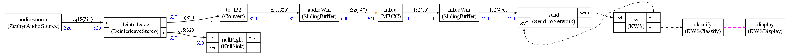

# CMSIS-Stream

CMSIS-Stream is a low overhead framework that can be used to build AI + multi-media applications.
It unifies the handling of video, audio, DSP and AI in the same framework.

Video, audio, AI, DSP components are all connected in a CMSIS Stream graph.

CMSIS Stream is low overhead : it can run on bare metal with no RTOS, on embedded systems with RTOS (Zephyr, RTX or any other RTOS) and it also works on Linux and Mac with optional interprocess communications.

CMSIS Stream is made of two parts : dataflow and events.

Processing elements in the graph can exchange data streams (dataflow) and send and receive events. An event is like a remote procedure call : it has a name and arguments.

CMSIS-Stream provides a Python package.

Python is used to:

* Describe the graph (streaming graph and event graph)
* Generate a **static scheduling** of the streaming graph that is computed **at build time** with several memory optimizations.
* Generate the code for this scheduler (state machine) as a simple C++ file (with a C API).
  * The scheduler can be run on bare metal devices. There is no dependencies to any RTOS. The scheduler is a sequence of function calls
* Connect all the nodes for events propagation in the graph of events

* Generate a graphical representation of the graph

The processing of the data streams in this graph has:

* low memory usage
* minimal overhead (build time computations)
* deterministic scheduling (state machine)
* modular design
* graphical representation

For the streaming part, C++ is only used for strong and static typing (template). The only part of the C++ library that is used is the memory allocator to create the objects before the graph is started. You control memory allocations during the execution of the graph.

For the event graph (which is optional) there is a dependency on the environment (RTOS, Rich OS or bare metal) and an implementation of the event runtime must be provided. See the section of the documentation about the event graph.

The current repository does not (yet) provide implementations of the event runtime except as an example with CMSIS-RTOS API.

Only the API to be implemented for the event runtime is provided.
Some example implementations for CMSIS-RTOS, Zephyr and Linux will be provided soon.

Here is an example of graph running on Zephyr and implementing a
keyword spotting demo for Cortex-M with DSP pre-processing (microphone + MFCC), TensorFlow Lite for Micro component and additional components for majority voting and display on LCD with animation:

This demo uses Helium acceleration and the Ethos NPU and is multi-threaded with fading animations on the LCD when keywords are recognized.

## License Terms

CMSIS-Stream is licensed under [Apache License 2.0](LICENSE).

## Table of contents

1. ### How to get started

   1. [Simple graph creation example](Examples/simple/README.md)

2. ### How to write the Python script and the C++ wrappers

   1. [How to describe the graph in Python](Documentation/WritePython.md)
   2. [How to write the C++ wrappers to use your functions in the graph](Documentation/WriteCPP.md)
   3. [DSP Nodes for working with CMSIS-DSP](Examples/simpledsp/README.md)
   4. [Details about the generated C++ scheduler](Examples/example1/README.md)

3. ### [Examples](Examples/README.md)

4. ### API Details

   1. ### [Python API for creating a graph and its scheduling](Documentation/PythonAPI.md)

   2. ### [C++ default nodes for C++ wrappers](Documentation/CPPNodes.md)

5. ### [Memory optimizations](Documentation/Memory.md)

6. ### [Integration in a system](Documentation/Integration.md)

   1. #### [Node identification](Documentation/NodeIdent.md)

7. ### [Graph of events](Documentation/Events.md)

8. ### Extensions

   1. #### [Cyclo-static scheduling](Documentation/CycloStatic.md)

   2. #### [Dynamic / Asynchronous mode](Documentation/Async.md)

9. ### [Maths principles](Documentation/MATHS.md)

10. ### [FAQs](Documentation/FAQ.md)
